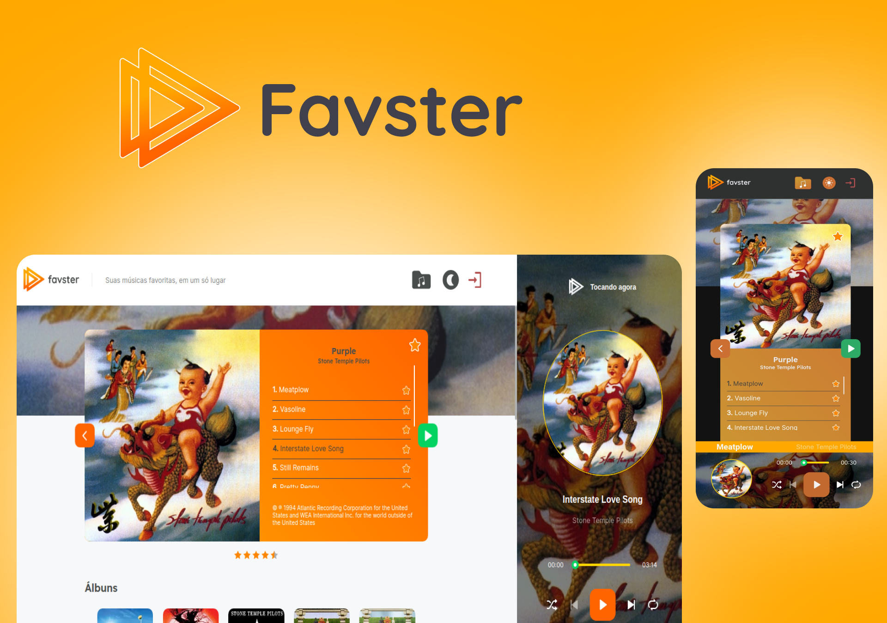

<h3 align="center">
  
</h3>

<h3 align="center">
  Player de músicas, integrado com a API da Napster, onde é possível procurar por artistas, álbuns e músicas, ouvir um preview e salvá-los como favoritos na sua biblioteca. 
</h3>

<p align="center">
  
  
  
  <a href="https://github.com/Jefferson00/Favster/commits/master">
      
  </a>
  <a href="https://www.linkedin.com/in/jefferson-c-silva-aa1b7b1a9/">
    
  </a>
</p>

<p align="center">
  
</p>

## 💻 Projeto (🚧 Em desenvolvimento 🚧)

<strong>Favster</strong> é um player de músicas acessado via web, integrado com a [API da Napster](https://developer.napster.com/api/v2.2), onde é possível procurar por artistas, álbuns e músicas, ouvir um preview e salvá-los como favoritos em uma biblioteca. 

<p align="center">
  
</p>

Desenvolvido com [NextJS](https://nextjs.org/) (framework para  [ReactJS](https://reactjs.org/)), a aplicação utiliza o recurso de <strong>Server Side Rendering</strong> do NEXT para buscar na API as principais informações necessárias, disponibilizando para o usuário assim que a página é acessada. No desenvolvimento foi utilizado o [TypeScript](https://www.typescriptlang.org/) como linguagem. Para quem não conhece, typescript é um superset do <strong>Javascript</strong>, onde é possível trabalhar com tipagem estática. Utilizando o typescript é possível descobrir melhor os erros e aumentar a inteligência da IDE durante o desenvolvimento. 

Para a estilização foi utilizado o [SASS](https://sass-lang.com/) (uma linguagem de extensão do CSS) que permite trabalhar de forma mais produtiva e organizada, como separar os estilos em módulos. Além disso, eu utilizo o [Framer Motion](https://www.framer.com/motion/), uma biblioteca completa para  a criação de animações e efeitos de interação.

A aplicação faz integração com a <strong>API da Napster</strong> através do cliente HTTP [Axios](https://github.com/axios/axios) e ainda possui integração com o [Firebase](https://firebase.google.com/) para a autenticação e o [Real Time Database](https://firebase.google.com/docs/database) para a persistência dos dados salvos como favoritos na biblioteca. 

Ainda foi gerado o <strong>PWA (Progressive Web App)</strong> da aplicação, onde é possível acessar o site como um aplicativo nativo. 

## 🚀 Tecnologias
- [TypeScript](https://www.typescriptlang.org/)
- [ReactJS](https://reactjs.org/)
- [NextJS](https://nextjs.org/)
- [SASS](https://sass-lang.com/)
- [Firebase](https://firebase.google.com/)

## 🚀 Features
- [x] Autenticação do usuário para acessar a aplicação.
- [x] Opção de tema dark e light.
- [x] O usuário poderá pesquisar por artistas, álbuns e músicas.
- [x] O usuário poderá acessar a página do artista, mostrando detalhes como imagem, bio e principais álbuns e músicas.
- [x] O usuário poderá acessar a página do álbum, podendo reproduzir uma preview das músicas, ver outros álbuns do mesmo artista e álbuns similares.
- [x] O usuário poderá salvar artistas, álbuns e músicas como favoritos.
- [x] O usuário poderá avaliar os seus favoritos. 
- [x] O usuário poderá acessar sua biblioteca com todos seus favoritos ordenado pela nota de avaliação. 


## ℹ️ How To Use


```bash
# Clone this repository
$ git clone https://github.com/Jefferson00/Favster

# Go into the repository
$ cd Favster

# Install dependencies
$ yarn install 
or 
$ npm install

# Run
$ yarn dev 
or 
$ npm run dev

```

## 💻 Como contribuir

- Faça um Fork desse repositório,
- Crie uma branch com a sua feature: `git checkout -b my-feature`
- Commit suas mudanças: `git commit -m 'feat: My new feature'`
- Push a sua branch: `git push origin my-feature`

## 📝 License

<a href="/LICENSE">
    
 </a>

Made with ♥ by Jefferson C Silva :wave: [Get in touch!](https://www.linkedin.com/in/jefferson-c-silva)